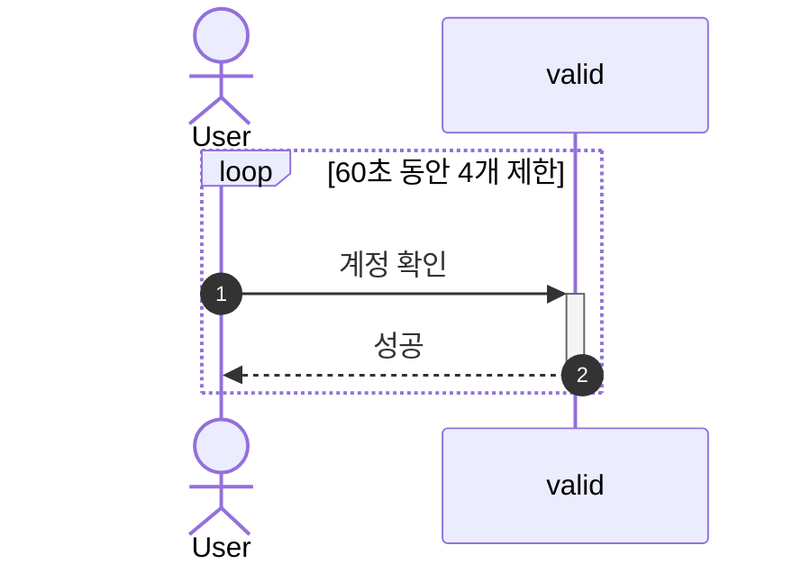
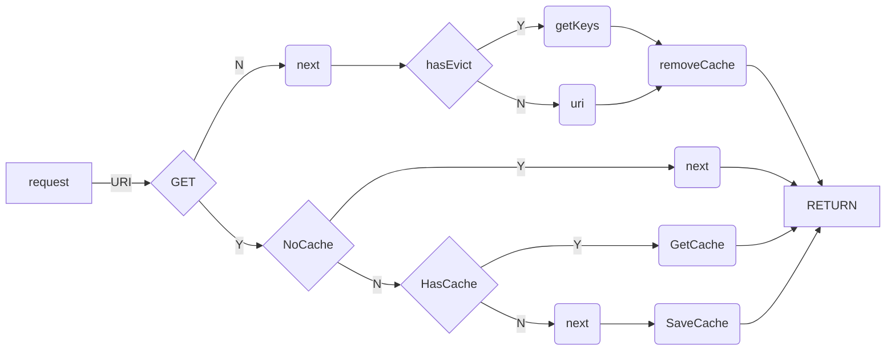

# NestJS 101


## [설명 PPT 문서 바로가기](https://www.slideshare.net/lahuman1/nest-js-101-241816990)

## 1. nestjs cli

> [nestjs cli](https://docs.nestjs.com/cli/overview) 를 이용하면 쉽게 프로젝트를 생성 할수 있습니다.

```
# nestjs cli 설치
$ npm i -g @nestjs/cli
# 프로젝트 생성
$ nest new project-name
```

## 2. [OpenAPI](https://swagger.io/specification/) 설정

> 다음 라이브러리를 설치합니다.

```
$ npm install --save @nestjs/swagger swagger-ui-express
```

> 이후 ```main.ts```에 SwaggerModule 설정을 합니다

```
# main.ts
import { NestFactory } from '@nestjs/core';
import { AppModule } from './app.module';
import { NestExpressApplication } from "@nestjs/platform-express";
import { SwaggerModule, DocumentBuilder } from '@nestjs/swagger';

async function bootstrap() {

  const app = await NestFactory.create<NestExpressApplication>(AppModule);

  const options = new DocumentBuilder()
    .setTitle('프로젝트 명')
    .setDescription('프로젝트 설명')
    .setVersion('1.0')
    .build();
  const document = SwaggerModule.createDocument(app, options);
  SwaggerModule.setup('docs', app, document);

  await app.listen(process.env.PORT);
}
bootstrap();
```

## 3. [Validation](https://docs.nestjs.com/techniques/validation)

> request 요청에 대한 Validation(검증) 처리를 위해
다음 라이브러리의 설치가 필요 합니다.

```
$ npm install class-validator
```

> Global 설정을 main.ts에 추가 합니다.
[Transform payload objects](https://docs.nestjs.com/techniques/validation#transform-payload-objects) 설정을 하여 자동 변환 처리를 합니다.

```
# main.ts
import { NestFactory } from '@nestjs/core';
import { AppModule } from './app.module';
import { NestExpressApplication } from "@nestjs/platform-express";
import { SwaggerModule, DocumentBuilder } from '@nestjs/swagger';
import { ValidationPipe } from '@nestjs/common';

async function bootstrap() {

  const app = await NestFactory.create<NestExpressApplication>(AppModule);
  app.useGlobalPipes(new ValidationPipe({transform: true})); // Validate with 자동 변환 처리
  const options = new DocumentBuilder()
    .setTitle('프로젝트 명')
    .setDescription('프로젝트 설명')
    .setVersion('1.0')
    .build();
  const document = SwaggerModule.createDocument(app, options);
  SwaggerModule.setup('docs', app, document);

  await app.listen(process.env.PORT);
}
bootstrap();
```

> 이후 예제는 [auto-validation](https://docs.nestjs.com/techniques/validation#auto-validation)에서 확인하세요.

## 4. [Configuration](https://docs.nestjs.com/techniques/configuration)

> express에서는 dotenv를 사용하였는데, nestjs에서는 Configuration이 제공 됩니다.
설치는 아래와 같습니다.

```
$ npm i --save @nestjs/config
```

> 사용법은 ```app.module.ts```에 선언을 하여서 사용합니다. isGlobal 설정을 해두면 다른 모듈에서 imports 하지 않고 사용이 가능합니다.
기본적으로 .env 파일을 읽어서 변수화 하여 사용합니다.


```
import { Module } from '@nestjs/common';
import { ConfigModule } from '@nestjs/config';

@Module({
  imports: [ConfigModule.forRoot({  isGlobal: true })],
})
export class AppModule {}
```

> 더 자세한 예제는 [Using the ConfigService](https://docs.nestjs.com/techniques/configuration#using-the-configservice)를 참조하세요.


## 4. [Logger](https://docs.nestjs.com/techniques/logger)

> nestjs에서는 기본적으로 Logger class를 제공합니다.
```main.js```에서 ApplicationModule에서 logger 옵션을 이용해서 레벨을 설정할 수 있습니다.
레벨은 'log', 'error', 'warn', 'debug', 'verbose' 이 있습니다.

```
const app = await NestFactory.create(ApplicationModule, {
  logger: ['error', 'warn'],
});
await app.listen(3000);
```

> 사용법은 [Using the logger for application logging](https://docs.nestjs.com/techniques/logger#using-the-logger-for-application-logging) 같이 주입하여 사용이 가능합니다.

```
import { Logger, Injectable } from '@nestjs/common';

@Injectable()
class MyService {
  private readonly logger = new Logger(MyService.name);

  doSomething() {
    this.logger.log('Doing something...');
  }
}
```

## 5. [session](https://docs.nestjs.com/techniques/session)

> 세션은 express를 사용할 경우 express-session 모듈을 설치해서 사용합니다.

```
$ npm i express-session
```

> 사용법은 ```main.ts```에 아래 코드를 추가합니다.(이는 [express-session](https://www.npmjs.com/package/express-session) 사용법을 자세히 보세요.)

```
import * as session from 'express-session';
// somewhere in your initialization file
app.use(
  session({
    secret: 'my-secret',
    resave: false,
    saveUninitialized: false,
  }),
);
```

## 6. [helmet](https://docs.nestjs.com/security/helmet) & [cors](https://docs.nestjs.com/security/cors) 설정

> helmet 과 cors 설정은 다른 설정 함수 보다 먼저 설정되어야 합니다. 
만약 경로를 정의한 후 helmet과 cors를 설정할 경우 이미 설정된 경로의 미들웨어는 적용되지 않을 수 있습니다.

> helmet은 http 해더를 적정하게 설정하여 웹 취약점으로 부터 앱을 보호 합니다.
설치 

```
$ npm i --save helmet
```

> 사용법 

```
import * as helmet from 'helmet';
// somewhere in your initialization file
app.use(helmet());
```

> cors는 다른 도메인에서 리소스를 요청 할 수 있도록하는 설정입니다.
설치는 따로 필요 없습니다. 사용법은 아래와 같습니다.

```
const app = await NestFactory.create(AppModule);
app.enableCors();
await app.listen(3000);
```

## main.ts 예제

> 다음은 제가 사용한 예제 입니다.

```
import { NestFactory } from '@nestjs/core';
import { AppModule } from './app.module';
import { NestExpressApplication } from "@nestjs/platform-express";
import * as helmet from 'helmet';
import { SwaggerModule, DocumentBuilder } from '@nestjs/swagger';
import { ValidationPipe } from '@nestjs/common';
import * as session from 'express-session';
import * as passport from 'passport';
import flash = require('connect-flash');

async function bootstrap() {

  const app = await NestFactory.create<NestExpressApplication>(AppModule);
  app.setGlobalPrefix('api'); // prefix 설정
  app.useGlobalPipes(new ValidationPipe({ transform: true })); // validate 사용 설정
  app.use(helmet({
    contentSecurityPolicy: false,
  })); // helmet 설정과 CSP 제외 (google analytics 사용시 제외 해야함)
  app.enableCors({
    origin: [
      /^(.*)/,
    ],
    methods: 'GET,HEAD,PUT,PATCH,POST,DELETE,OPTIONS',
    preflightContinue: false,
    credentials: true,
    optionsSuccessStatus: 204,
    allowedHeaders:
      'Origin,X-Requested-With,Content-Type,Accept,Authorization,authorization,X-Forwarded-for',
  }); // cors 설정 credentials 설정을 해야 credentials 정보도 함께 전달함

  const options = new DocumentBuilder()
    .setTitle('프로젝트 명')
    .setDescription('프로젝트 설명')
    .setVersion('1.0')
    .addBearerAuth() // openapi 문서에서 권한 처리 추가
    .build();
  const document = SwaggerModule.createDocument(app, options);
  SwaggerModule.setup('docs', app, document); // openapi 사용

  app.use(session({
    secret: process.env.SECCRET || 'keyboard cat',
    resave: false,
    saveUninitialized: false,
  })); // session 사용
  // passport 설정
  app.use(passport.initialize()); 
  app.use(passport.session());
  // request에 값을 추가 하는 flash 추가 
  app.use(flash());

  await app.listen(process.env.PORT);
}
bootstrap();
```


## [nestjs-pino]](https://www.npmjs.com/package/nestjs-pin) 적용 (2023.01.17)

> 로깅시 요청 정보를 함께 적재하여, 각 로그별 연결 처리


## [throttler-ratelimiting](https://docs.nestjs.com/security/rate-limiting) 처리 (2022.09.16)



- [@nestjs/throttler](https://github.com/nestjs/throttler)
  > throttler 모듈을 변경해서 로그인 계정 기준으로 특정 시간동안 요청 제한 처리
- 추가 및 변경 소스 목록 
  + src/app.module.ts : throttler 모듈 설정
  + src/app.controller.ts : 사용 예제(valid method)
  + src/common/core/throttler.guard.ts : guard 설정
  + src/common/core/throttler-storage-redis.service.ts_b : redis를 storage 사용시 예제
 
## [chaching](https://docs.nestjs.com/techniques/caching) 처리 (2022.09.11)



- httpcache.interceptor.ts 
  > URL 기준으로 http method가 ```get``` 일 경우 데이터 값을 저장 처리하며 ```post```, ```delete```, ```put``` 등이 호출 될 경우 URL 기준으로 기존 캐시를 삭제
- cache.decorator.ts
 > ```@NoCache``` 캐시 예외 처리 ```@CacheEvict``` 캐시 삭제시 다른 url 함께 처리 
 
## ```@nestjs/config```를 활용한 설정파일 관리  (2022.09.15)

```src/common/config``` 에 각 항목의 설정 파일을 적재후 사용 

- logging
- database
  + SnakeNamingStrategy 추가
  + QueryLogger 추가

## ```@nestjs/config```를 이용한 상수처리  (2022.04.15)
 
 ```.env``` 에서 필요한 상수를 로드하는 처리

 - logger에 대한 상수 처리
 - typeorm에 대한 상수 처리

### 사용 예제 

```src/app.module.ts``` 파일에서 ```forRootAsync```과 ```useFactory```을 이용하여 ```.env``` 파일의 상수를 활용

```javascript
...
 TypeOrmModule.forRootAsync({
      imports: [ConfigModule],
      inject: [ConfigService],
      useFactory: (configService: ConfigService) => ({
        type: 'sqlite',
        database: configService.get('DB_HOST'),
        dropSchema: configService.get('DB_DROP') === 'true',
        entities: ['dist/**/*.entity{.ts,.js}'],
        synchronize: configService.get('DB_SYNC') === 'true',
        logging: configService.get('DB_LOGGING') === 'true',
        logger: 'file',
      }),
    }),
....

```
## winston + winston-daily-rotate-file 추가 (2022.04.14)

### 추가 모듈 설치 

- [winston](https://www.npmjs.com/package/winston) : winston
- [nest-winston](https://www.npmjs.com/package/nest-winston) : nestjs에서 winstion 사용 처리
- [winston-daily-rotate-file](https://www.npmjs.com/package/winston-daily-rotate-file) : 날짜별 파일 생성 및 관리 지원

```bash
# nestjs에서 winston 과 관련된 모듈 추가 
$ npm i nest-winston winston winston-daily-rotate-file
```

### 사용 예제

main.js에서 아래와 같이 설정하여 사용

```javascript
import { WinstonModule } from 'nest-winston';
import * as winston from 'winston';

...

const app = await NestFactory.create(AppModule, {
    logger: WinstonModule.createLogger({
      format: winston.format.combine(
        winston.format.timestamp(),
        winston.format.json(),
      ),
      transports: [
        new winston.transports.Console(),
        new (require('winston-daily-rotate-file'))({
          dirname: path.join(__dirname, './../logs/debug/'), // 파일 저장 위치
          filename: 'debug-%DATE%.log', // 파일 명
          datePattern: 'YYYY-MM-DD-HH', // 파일명의 날짜(DATE) 패턴
          level: 'debug', // 로그 레벨
          zippedArchive: true, //압축 여부
          maxSize: '20m', // 한개의 파일 최대 크기
          maxFiles: '14d' // 파일의 최대 유지 날짜
        }),
        new (require('winston-daily-rotate-file'))({
          dirname: path.join(__dirname, './../logs/info/'),
          filename: 'info-%DATE%.log',
          datePattern: 'YYYY-MM-DD-HH',
          level: 'info',
          zippedArchive: true,
          maxSize: '20m',
          maxFiles: '14d'
        }),
      ],
    })
  });

...  
```

## ACCESS 로깅 middleware 추가(2022.04.11) 

```src/common/middleware/AppLoggerMiddleware.ts``` 파일 추가 및 ```src/app.module.ts```에 다음 내용 추가

```javascript
// src/common/middleware/AppLoggerMiddleware.ts
import { Request, Response, NextFunction } from "express";
import { Injectable, NestMiddleware, Logger } from "@nestjs/common";

@Injectable()
export class LoggerMiddleware implements NestMiddleware {
  private logger = new Logger("HTTP");

  use(request: Request, response: Response, next: NextFunction): void {
    const { ip, method, originalUrl } = request;
    const userAgent = request.get("user-agent") || "";

    response.on("finish", () => {
      const { statusCode } = response;
      const contentLength = response.get("content-length");

      this.logger.log(
        `${method} ${originalUrl} ${statusCode} ${contentLength} - ${userAgent} ${ip}`,
      );
      if (method !== 'GET') {
        this.logger.debug(request.body);
      }
    });

    next();
  }
}

// src/app.module.ts
export class AppModule implements NestModule {
  configure(consumer: MiddlewareConsumer): void {
    consumer.apply(AppLoggerMiddleware).forRoutes('*');
  }
}
```


## 테스트 케이스 추가(2021.06.23)

테스트 케이스를 추가하였습니다.

> user.controller.spec.ts 파일을 기준으로 End to End 테스트 케이스를 작성하였습니다.


### 전체 테스트 실행

```
npm run test
```

### 특정 테스트 케이스 실행

```
node node_modules/jest/bin/jest.js src/user/user.controller.spec.ts
```


## 로그인 & DB 연결 예제 추가(2021.06.17)

- typeorm + sqlite 조합의 사용자 CRUD 구현
- passport + local strategy를 이용한 로그인/로그아웃 처리 
    - [test-auth-chapter-sample](https://github.com/lahuman/test-auth-chapter-sample)를 참조하여 구현 하였습니다. 

### auth 모듈 아래에 로그인 관련 설정이 있습니다.

### common 디렉토리 아래에 로그인 처리를 위한 filters / guards 가 추가 되었습니다.

### user 모듈 아래에 사용자 정보 CRUD 구현 예제가 있습니다.


## 상세한 예제는 다음 2개의 프로젝트를 참고 하세요.

1. [nestjs-realworld-example-app](https://github.com/lahuman/nestjs-realworld-example-app/tree/swagger-docs)
2. [test-auth-chapter-sample](https://github.com/lahuman/test-auth-chapter-sample)

## 참고자료
- [First steps](https://docs.nestjs.com/first-steps)
- [nestjs cli](https://docs.nestjs.com/cli/overview)
- [nestjs 테스트 케이스 예제](https://lahuman.github.io/nestjs_jest_testcase/)
